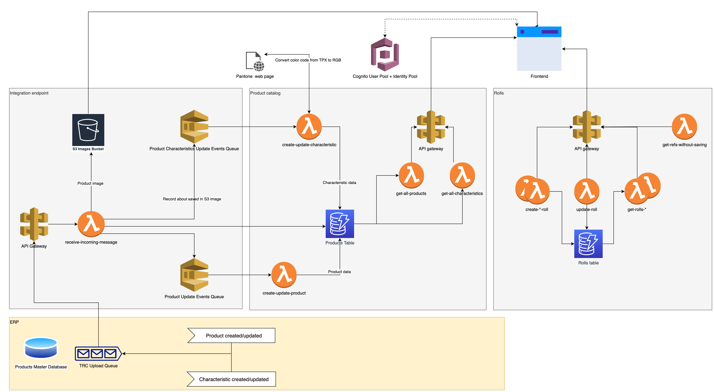

# TRC (Textile Rolls Controller)

A textile factory floor management software for tracking fabricated rolls after they are released from a dyeing (finishing) department. **TRC** features:

 - [x] roll registration
 - [x] roll cutting 
 - [x] quality control data input
 - [x] label creation
   
Not yet implemented:

 - [ ] roll packaging 
 - [ ] rolls order fulfillment
 - [ ] consolidated transfer of produced rolls to ERP

**TRC** must be integrated with existing ERP system, which servers as a Master Data Management system. ERP sends events to TRC, describing updates to products and characteristics. TRC uses this events to rebuild a read-only copy of a product catalog. Integration with `1C:Enterprise ERP 2.4` is implemented, but the implementation is currently not open-sourced. 

**TRC** is a serverless app, intended to run only on AWS cloud. It uses SQS, Cognito, DynamoDB, S3 and other AWS services.

## Demo

View [demo gifs](./docs/demo.md), demonstrating main features.

## Components

| Component |                       Desrciption |
|-----------------|---|
| [Shared Components](./backend-shared) | AWS infrastructure that is used by more than one service: User pool, shared S3 buckets etc. | 
| [Integration Endpoint](./integration-endpoint) | Provides an HTTP endpoint for ERP to send events, describing updates in products. ERP is authenticated via an API key. |
| [Product Catalog](./product-catalog) |  Stores products and product characteristics (descriptions and pictures). |
| [Rolls](./rolls) | Core component of TRC: provides mechanisms for creation, modification and retrieval of various types of rolls: original, modified, descendant (cut up). |
| [Frontend](https://github.com/sgalushin/textile-rolls-controller-frontend) | Web interface (a separate repo). |

### Components Overview

## Getting Started & Deployment

### Requirements

 * Node 14
 * [SAM CLI](https://docs.aws.amazon.com/serverless-application-model/latest/developerguide/serverless-sam-cli-install.html)
 * [GNU Make](https://www.gnu.org/software/make/)  
 * [Docker](https://docs.docker.com/install/) (for running service tests with DynamoDB Local)

### Deployment of the whole TRC project

1. [Deploy the backend](#backend-deployment) (this project).

2. Update the 1C:ERP instance with TRC integration patches. Create a new Integration endpoint with the following parameters:
   - `URL` is a value of an output `APIAddress` from `TRC-${STAGE}-integration-endpoint` stack.
   -  `Key` is `INTEGRATION_API_KEY` that was specified at step 1.

3. Deploy the frontend. Make sure that during the build process all necessary environment variables exist - see `README.md` in the frontend project.

4. Log in into AWS Console, go to Cognito, select corresponding User Pool and create the first user (by default in all project's CloudFormation templates user registration is disabled for security reasons). Try to log in into web interface using these credentials.

5. To perform an initial population of a TRC Product Catalog, in the 1C:ERP instance execute "save in batch" command for all necessary products and their corresponding characteristics; this will put them into an upload queue. Set up a scheduled upload to the TRC endpoint (set up at step 2) or trigger a manual upload.

### Backend deployment

1. Manually create an S3 bucket (or use an existing one). This bucket will be used as `BUCKET_FOR_LAMBDAS` during deployment. 

2. Run `make install` to install npm packages for every service.

3. (optional) By default CORS policy is `Allow-Origin: "*"`. You can tighten CORS restrictions in the Product Catalog and Rolls services: 
   - Change the `Api/Properties/Cors/AllowOrigin/` section in each `template.yaml`.
   - Change `SERVICE_DIRECTORY/src/lambda-handlers/accessControlHeaders.json`

4. From the root project directory run the following command:

`make deploy PARAMETERS`

| Parameter | Example | Description |
|---|---|---|
| STAGE | dev | An identifier of a specific instance of an app. Might match a git branch. |
| INTEGRATION_API_KEY | wcqp4peshv57dulfakpm | An API key that will be used to authenticate 1C:ERP instance, sending events to the Integration Endpoint. Must be a string, minimum 20 characters. | 
| REGION | eu-west-1 | AWS region
| BUCKET_FOR_LAMBDAS | my-bucket-for-lambdas-0492320 | An S3 bucket, located in the `REGION` region. `sam package` command, defined in the `Makefile`, will put lambda's source code in this bucket.

Example: `make deploy STAGE=st2 INTEGRATION_API_KEY=wcqp4peshv57dulfakpm REGION=eu-west-1 BUCKET_FOR_LAMBDAS=my-bucket-for-lambdas-0492320`

Keep in mind that when deploying a new stage, integration API key must not be reused from another stages. Thus, there must not be more than one stage with the same integration key.

After initial deployment specific services can be updated with `make deploy.SERVICE` command, for example
`make deploy.rolls STAGE=st2 INTEGRATION_API_KEY=wcqp4peshv57dulfakpm REGION=eu-west-1 BUCKET_FOR_LAMBDAS=my-bucket-for-lambdas-0492320`

## Testing

### Unit tests

Before running tests make sure you have installed all packages by running `make install` from the project root directory.

To run all tests execute `make test` from the project root directory.

To test that package execute `npm run test` from that package's directory.

All unit tests require DynamoDB Local to be available on `localhost:8000`. To run it in Docker use `docker run -p 8000:8000 -d amazon/dynamodb-local`. Unit tests create randomly named DynamoDB tables and don't delete them after the test (for performance reasons). The expectation is that the DynamoDB Local container should be easily discarded. Running multiple iterations of tests on the same container is fine as a chance for a collision in table names is extremely unlikely.
 
You can change the default location for DynamoDB Local by running tests with the following environment variables:

| Variable Name | Example & Default Value (ie. without the variable being set) | Description |
|---|---|---|
|DYNAMODB_TEST_REGION | eu-west-1 | The value doesn't matter for local DynamoDB Instance (but it cannot be empty) |
| DYNAMODB_TEST_URL | http://localhost:8000 | |

### End-to-End tests

To be done.

## CI / CD

TRC uses [AWS CodeBuild](https://aws.amazon.com/codebuild/). Build configuration is in [buildspec.yml](./buildspec.yml).

When creating a CodeBulid project, use the following settings:
 
- Use `Ubuntu` image (instead of default`Amazon Linux`) as it is the only one that supports Node 14.
- Check `Priviledged` flag to enable running Docker (for unit tests).
- Create the same environment variables, that are described in [Backend Deployment](#backend-deployment).
- In AWS Secrets Manager create a secret named `GITHUB_CREDENTIALS` with two keys: `PRIVATE_KEY` and `PUBLIC_KEY`. The values should be corresponding base64 encoded GitHub ssh keys.

Usage of ssh keys is required for npm to be able to download a forked package of `dynamodb-toolbox`. Currently, it is not possible to enforce npm to download packages with explicit references to GitHub using `https` (see https://github.com/npm/cli/issues/2610).

## Project status

This app was created as a pre-sales proof-of-concept for a specific client to demonstrate the feasibility of moving some parts of the existing classic three-tier ERP application to a serverless AWS stack. Currently, its development is abandoned.

## License

This project is licensed under the terms of the MIT license. See the [LICENSE](./LICENSE.txt) file.
